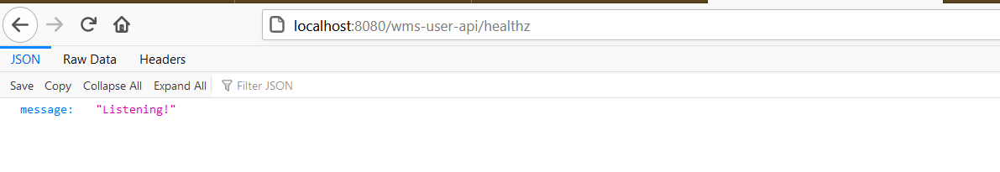
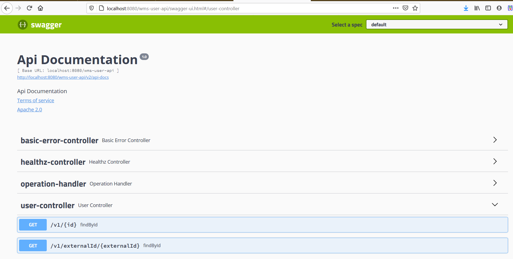

# wms-user-api

> ### OBJECTIVES

 API para gerenciamento de usuarios do sistema WMS

> ### ACTUAL REPOSITORY
```sql
-- -----------------------------------------------------
-- Table s_user.user
-- -----------------------------------------------------
create schema s_user;

CREATE TABLE IF NOT EXISTS s_user.user (
  id SERIAL NOT NULL,
  external_id VARCHAR(100) NOT NULL,
  name VARCHAR(100) NULL,
  full_name varchar(100) NOT null,
  email VARCHAR(100) NULL,
  facility_id INT NULL,
  country varchar(2) NOT null,
  "level" int NOT null,
  created_at TIMESTAMP with time zone NOT NULL,
  updated_at TIMESTAMP with time zone NULL,
  deleted_at TIMESTAMP with time zone NULL,
  created_by INT NOT NULL,
  updated_by INT NULL,
  deleted_by INT NULL,
  PRIMARY KEY (id))
;

insert into s_user.user (id, external_id, name, full_name, email, facility_id, country, "level", created_at, created_by)
    values (1, 'SYSADM','System Admin','System Admin','brunoaptavares@gmail.com',1,'BR',9,current_timestamp, 1);
commit;
```

> #### ENVOLVED TECHNOLOGIES

- Java 11
- Maven
- Spring Boot
- Docker
- PostgreSQL
- Amazon ECS

> #### MASTER DEPENDENCIES

- Java OpenJDK 11
- Maven 3.6.3
- Spring Boot 2.3.2

> #### SUPPORTED CONTRACTS

To get a specific user data, make the call bellow:
- **GET: /wms-user-api/v1/{userId}:**

The response, if has terminated with success, contains the sample payload bellow for id = 1:   
```json
{
  "id": 1,
  "externalId": "SYSADM",
  "name": "System Admin",
  "email": "sysadm@mercadofavo.com",
  "facilityId": null,
  "createdAt": "2020-08-12T16:24:26.896+00:00",
  "updatedAt": null,
  "deletedAt": null,
  "createdBy": 1,
  "updatedBy": null,
  "deletedBy": null
}
```

> #### SCHEMA MIGRATIONS
### *Entities*
- **s_user.user**

> #### GETING THE SOURCE CODE

Open a UNIX terminal and create a root directory for the project:
```sh
$ cd ~
$ mkdir wms-user-api
$ cd wms-user-api
```

Then clone the project from bitbucket by git clone command line (https version):
```sh
$ git clone https://bitbucket.org/aiyuapp/wms-user-api.git
```

> #### BUILDING THE PROJECT

On the root of project use maven plugin to generate the executable jar file:

```sh
$ mvn package
```

> #### SETTING THE ENVIRONMENT VARIABLES

The environment must be resolved by spring boot profiles feature. The supported profiles are develop, qa, uat and production:
```json
{
    "develop": {
        "spring.database.driverClassName": "org.postgresql.Driver",
        "spring.datasource.url": "jdbc:postgresql://localhost:5432/user",
        "spring.datasource.username": "postgres",
        "spring.datasource.password": "postgres"
    }
}
```

> #### BUILDING A IMAGE FROM Dockerfile

Enter on the root of project and execute docker build command line:
```sh
$ cd ~
$ cd wms-user-api
$ docker build -t wms-user-api .
```

Startup the container:
```sh
$ docker run -it --rm -p 8080:8080 wms-user-api  .
```

> #### CHECK THE AVAILABILITY OF SERVICE:

http://localhost:8080/wms-user-api/healthz



http://localhost:8080/wms-user-api/swagger-ui.html



> #### Maintainers: Favo WMS Squad 
